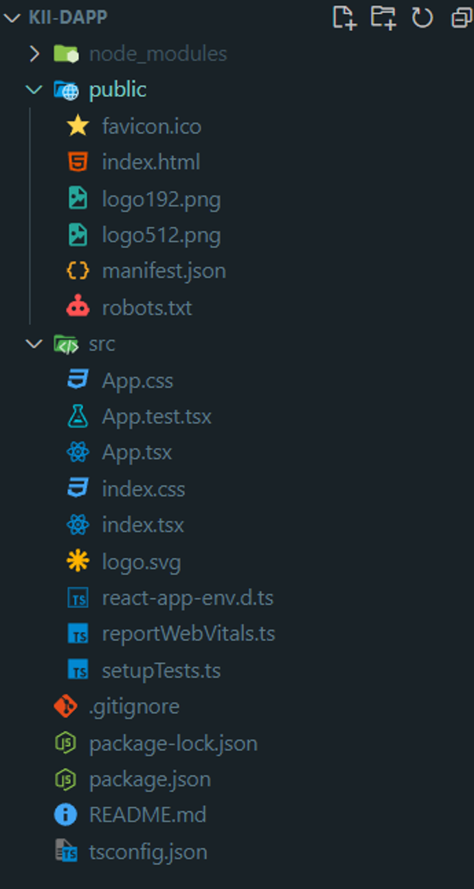

# Deploy a dApp

## Introduction

In this tutorial, you will learn how to create a simple decentralized application (dApp) built on KiiChain. We will use tools such as React, TypeScript, and Ethers.js to build a basic wallet management system.

## Project setup

### Tools

We will be using the following tools:

* `npx` for managing Node.js packages and running commands.
* `ethers` for interacting with the Ethereum blockchain and other compatible chains like KiiChain.
* `React` for building the user interface.
* `TypeScript` for adding static types to JavaScript.

### Create project

First, navigate to your working directory, open a terminal, and run the following commands to create a new React project with TypeScript:

```bash
npx create-react-app kii-dapp --template typescript
cd kii-dapp
```

After the project is set up, open the code in your preferred editor. If you are using Visual Studio Code, you can do this with:

```bash
code .
```

You should now see the following project structure:

<figure><figcaption></figcaption></figure>

### Install dependencies

Next, you need to install the `ethers` library. Run the following command in the terminal within your project directory:

```bash
npm i ethers
```

The version used in this tutorial is [Ethers.js v6](https://docs.ethers.org/v6/).

## Coding the dApp

### Create the Repository

Create a new file at `src/repository/kiichain.repository.ts`. The directory needs to be created.

```tsx
import { ethers } from 'ethers';

export function getProvider(): ethers.JsonRpcProvider {
    const url = "<https://a.sentry.testnet.kiivalidator.com:8645/>";
    const provider = new ethers.JsonRpcProvider(url, {
        chainId: 123454321,
        name: "kiichaind",
    });
    return provider;
}

export function getSigner(
    wallet: ethers.Wallet,
    provider: ethers.JsonRpcProvider
): ethers.Wallet {
    return wallet.connect(provider);
}

export function createWallet(
    provider: ethers.JsonRpcProvider
): ethers.HDNodeWallet {
    return ethers.Wallet.createRandom(provider);
}

export function getWalletFromPhrase(
    Phrase: string,
    provider: ethers.JsonRpcProvider
): ethers.HDNodeWallet {
    return ethers.Wallet.fromPhrase(Phrase!).connect(provider);
}
```

This repository file contains functions for basic operations like creating a wallet, connecting to a wallet using a seed phrase, and getting the balance of a wallet.

### What is a Signer and a Provider?

In decentralized application (dApp) development, especially when interacting with blockchains like KiiChain, it's essential to understand the concepts of **Provider** and **Signer**. These components play crucial roles in communicating with and managing transactions on the blockchain.

#### Provider

A **Provider** is a component that allows your dApp to connect to and interact with the blockchain. It provides methods to read data from the blockchain, such as transaction statuses, account balances, and other network details. The provider does not have access to private keys and therefore cannot sign transactions.

#### Signer

A **Signer** is a component that represents an entity capable of making transactions on the blockchain, meaning it can sign them. A signer has access to the private keys necessary to authorize and send transactions, allowing you to modify the blockchain state, such as transferring tokens or interacting with smart contracts.

### Create the Wallet Manager Component

Create a new file at `src/components/WalletManager.tsx` . The directory needs to be created

```tsx
import React, { useEffect, useState } from 'react';
import { ethers } from 'ethers';
import { createWallet, getProvider, getWalletFromPhrase } from '../repository/kiichain.repository';

const WalletManager: React.FC = () => {
    const [wallet, setWallet] = useState<ethers.HDNodeWallet | null>(null);
    const [balance, setBalance] = useState<string | null>(null);
    const [mnemonic, setMnemonic] = useState<string>(''); // Estado para la seed phrase

    const provider = getProvider();

    // Handle wallet creation
    const handleCreateWallet = (): void => {
        const newWallet = createWallet(provider);
        setWallet(newWallet);
        console.log('New Wallet Address:', newWallet.address);
        console.log('Seed Phrase:', newWallet.mnemonic?.phrase);
    };

    // Handle connecting to a wallet via a mnemonic phrase
    const handleConnectWallet = (): void => {
        if (!mnemonic) {
            console.error('Mnemonic is empty');
            return;
        }
        const existingWallet = getWalletFromPhrase(mnemonic, provider);
        setWallet(existingWallet);
        console.log('Connected Wallet Address:', existingWallet.address);
    };

    // Fetch and display wallet balance
    const handleGetBalance = async (): Promise<void> => {
        if (wallet) {
            const balance: bigint = await provider.getBalance(wallet.address);
            setBalance(ethers.formatEther(balance));
        } else {
            console.error('No wallet connected');
        }
    };

    useEffect(() => {
        if (wallet) {
            handleGetBalance();
        }
    }, [wallet]);
    return (
        <div>
            <h1>Kiichain Wallet Manager</h1>
            <button onClick={handleCreateWallet}>Create New Wallet</button>

            <div>
                <input
                    type="password"
                    value={mnemonic}
                    onChange={(e) => setMnemonic(e.target.value)}
                    placeholder="Enter your seed phrase"
                />
                <button onClick={handleConnectWallet}>Connect Wallet via Seed Phrase</button>
            </div>

            {wallet && <p>Wallet Address: {wallet.address}</p>}
            {balance && <p>Wallet Balance: {balance} Kii</p>}
        </div>
    );
};

export default WalletManager;

```

This component implements the functions from the repository and displays the relevant information, such as the wallet address and balance.

## Run the dApp

To check if everything is working correctly, you need to run the project. Open your terminal in the project directory and execute the following command:

```tsx
npm run start
```

If everything is set up properly, your application should start, and the following screen will appear:

<figure><figcaption></figcaption></figure>

### Testing the Wallet Functionality

1. **Create a New Wallet**: Click the "Create New Wallet" button. A new wallet will be generated, and the address along with the seed phrase will be displayed in the console.
2. **Access the Developer Console**:
   * Right-click anywhere on the page and select "Inspect" to open the Developer Tools.
   * Navigate to the "Console" tab to see the output.
3. **Connect to the Wallet**: Copy the seed phrase from the console, paste it into the input field under "Enter your seed phrase," and click "Connect Wallet via Seed Phrase."
4. **View Wallet Balance**: If connected successfully, the wallet's balance should be displayed on the screen.

By following these steps, you can confirm that the dApp is functioning as expected.

## Deploying the dApp Using Firebase

To deploy your decentralized application (dApp) using Firebase Hosting, follow these steps:

### Step 1: Set Up a Firebase Project

1.  **Create a Project in Firebase**:

    * Visit the [Firebase Console](https://console.firebase.google.com/).
    * Click on **"Create a project"**.

    <figure><figcaption></figcaption></figure>

    * Name your project and disable Google Analytics (optional for this tutorial).

    <figure><figcaption></figcaption></figure>

    

    * Click **"Continue"** once the project is ready.

    <figure><figcaption></figcaption></figure>
2.  **Access Firebase Hosting**:

    * In the left menu, go to **Build** → **Hosting**.
    * Click **"Get started"** to begin setting up Firebase Hosting.

    <figure><figcaption></figcaption></figure>

### Step 2: Initialize Firebase Hosting

1. **Install Firebase CLI**:
   *   Open your terminal and install Firebase CLI globally

       ```bash
       npm install -g firebase-tools
       ```
2.  **Login and Initialize Firebase**:

    *   Inside your project directory, run

        ```bash
        firebase login
        firebase init
        ```
    * During initialization, select the following options:
      * **Features**: Hosting: Configure files for Firebase Hosting
      * **Project Setup**: Use an existing project
      * **Public Directory**: ‘build’
      * **Single-page App**: No
      * **Automatic Builds/Deploys**: No

    ```bash
    ? Are you ready to proceed? Yes
    ? Which Firebase features do you want to set up for this directory? Press Space to select features, then Enter to confirm your choices. Hosting: Configure files  
    for Firebase Hosting and (optionally) set up GitHub Action deploys

    === Project Setup

    First, let's associate this project directory with a Firebase project.
    You can create multiple project aliases by running firebase use --add,
    but for now we'll just set up a default project.

    ? Please select an option: Use an existing project
    ? Select a default Firebase project for this directory: kii-dapp-test (kii-dapp-test)
    i  Using project kii-dapp-test (kii-dapp-test)

    === Hosting Setup

    Your public directory is the folder (relative to your project directory) that
    will contain Hosting assets to be uploaded with firebase deploy. If you
    have a build process for your assets, use your build's output directory.

    ? What do you want to use as your public directory? build
    ? Configure as a single-page app (rewrite all urls to /index.html)? No
    ? Set up automatic builds and deploys with GitHub? No
    +  Wrote build/404.html
    +  Wrote build/index.html

    i  Writing configuration info to firebase.json...
    i  Writing project information to .firebaserc...

    +  Firebase initialization complete!
    ```

### Step 3: Build and Deploy Your dApp

1. **Build the project:**
   *   Run the following command to generate the production-ready files

       ```bash
       npm run build
       ```
2. **Deploy to Firebase**
   *   Deploy your built project to Firebase Hosting

       ```bash
       firebase deploy
       ```

       ```bash
       === Deploying to 'kii-dapp-test'...

       i  deploying hosting
       i  hosting[kii-dapp-test]: beginning deploy...
       i  hosting[kii-dapp-test]: found 14 files in build
       +  hosting[kii-dapp-test]: file upload complete
       i  hosting[kii-dapp-test]: finalizing version...
       +  hosting[kii-dapp-test]: version finalized
       i  hosting[kii-dapp-test]: releasing new version...
       +  hosting[kii-dapp-test]: release complete

       +  Deploy complete!

       Project Console: <https://console.firebase.google.com/project/kii-dapp-test/overview>
       Hosting URL: <https://kii-dapp-test.web.app>
       ```

Once the deployment is complete, the URL of your live dApp will be shown in the terminal.
